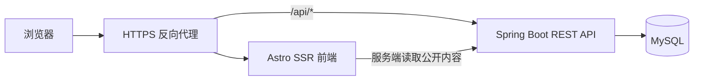
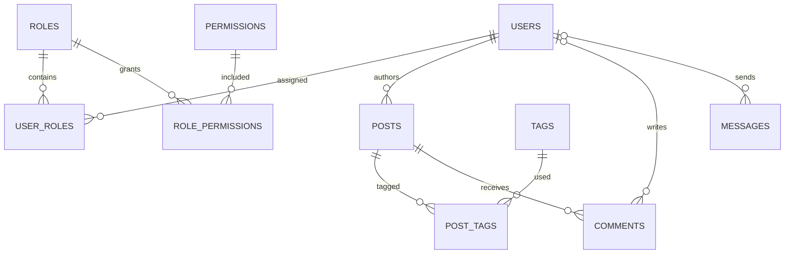

# 动态博客开发计划

> 本文描述目标架构和实施顺序；已完成内容以“实施记录”和各阶段状态为准，其他功能仍是计划。
>
> 文档更新时间：2026-09-26

## 实施记录

### 2026-09-25 至 2026-09-26：后端基础阶段进行中

- 已选用 Java 21、Maven 和 Spring Boot 4.1.1；这些版本可以在当前本地 JDK 21 环境构建。
- 已创建分支 `codex/backend-foundation`，项目与开发计划文档已保存为提交 `9071631`。
- 已建立 `backend/` Spring Boot 骨架、`/api/v1/health`、Actuator 就绪检查、Flyway MySQL 初始结构/角色权限种子，以及后端 GitHub Actions 构建与冒烟测试。
- 本地 `mvn clean verify` 已通过，健康接口冒烟测试 1 项通过。
- 已推送提交 `1c78999` 到 `codex/backend-foundation`；提交不包含 `.pem` 或服务器 `.env`。
- 云服务器为 Alibaba Cloud Linux 3；已有 Docker/Compose，现有网站容器使用 80 端口，另有现存 blog 数据库容器。宿主机没有 Java 或 MySQL Server；磁盘可用空间约 24 GB。
- 云端使用独立 Compose 项目和独立 MySQL 8.4 数据卷：数据库没有宿主机映射端口，API 只绑定 `127.0.0.1:18081`，现有网站与数据库容器没有修改。
- 云端测试结果：进程健康和包含 MySQL 的就绪检查均为 `UP`；Flyway 执行 2 个迁移；数据库有 3 个初始角色、13 项权限、20 条角色授权。停止后再次启动，schema 被识别为最新版本且数据计数不变。
- 测试容器随后已停止以释放服务器内存；测试数据卷保留，服务器可用内存恢复到约 747 MB。
- 已确认：账号只由管理员创建；评论和留言都要求登录；文章入库使用 Markdown，旧 MDX 在迁移导入时转换处理。
- 后端基础、实体/Repository/Service/DTO 分层和真实 MySQL 初始迁移验证已完成；阶段 1 的首次管理员初始化现已实现，并通过后端集成测试。
- 已完成实体与 Repository 映射，并在云端真实 MySQL 上通过 Hibernate schema 校验；测试栈已停止，测试数据卷保留。
- 公开文章 API 第一版已实现分页列表、文章详情、标签、标签筛选和数据库搜索；V3 迁移补齐作者名、修改时间、时区、精选、规范 URL、OG 图片和隐藏编辑链接字段。
- 提交 `373429d` 已推送到 `codex/backend-foundation`；本地 `mvn clean verify` 通过。
- 云端独立 MySQL 已应用 V3；用临时测试行验证文章列表/详情、frontmatter 元数据、Markdown 正文、标签计数/筛选和搜索，随后清理测试行。
- 云端测试栈已停止并保留独立测试卷；原网站和数据库容器仍运行，可用内存恢复到约 760 MB。Astro 页面和 MDX 转 Markdown 导入程序还未接入数据库。
- 用户确认账号仅由管理员创建，评论和留言都要求登录，旧文章迁移时将 MDX 转换为 Markdown。
- Astro 公开内容页面已切换至 Node SSR：首页、列表/分页、详情、标签、归档、搜索、RSS、sitemap 和文章 OG 图片通过 API 读取；文章组件沿用原有主题布局与 class。服务端 Markdown 使用与 Astro 构建相同的 remark/rehype/Shiki 配置。
- SSR 本地构建和 ESLint 通过；Java 21 后端测试 1 项通过。云端公开内容 SSR 联调已完成。
- SSR 联调发现生产裁剪依赖后缺少运行时 Markdown transformer，以及 OG 路由按外部请求 origin 回取字体失败；已将 transformer 移入生产依赖，并改为从构建字体文件本地读取。提交 `a353efb` 已推送。
- 本地 `astro check` 为 0 错误/警告/提示，生产构建、ESLint、改动文件 Prettier 检查通过。
- 云端隔离测试栈以 MySQL 临时文章验证首页、列表、详情、标签、归档、搜索、RSS、sitemap；文章详情返回 200，文章 OG 图片返回 1200×630 PNG。随后删除临时文章/标签/用户，确认测试数据计数归零，停止隔离栈并保留独立测试卷；生产站点容器持续运行。
- 本轮重建测试镜像时，服务器内核记录生产 MySQL 进程发生两次 OOM kill，Docker 自动重启了 `blog-db-1`；生产 Spring 应用日志出现连接池失效连接警告。复核时 MySQL 容器内 ping 成功、生产应用仍运行并响应登录重定向，隔离测试栈已停止。服务器内存有限，后续避免在生产容器运行时执行高内存云端构建；优先本地/CI 构建或先制定明确的资源与停机方案。
- 已实现 `backend/tools/prepare-content-import.mjs`：预检 18 篇文章、15 个标签、1 篇草稿、4 篇 MDX 转换和 12 个本地图片；保持原始 MD/MDX 文件不变，生成带单事务的只插入 SQL，并将本地图片复制到 `public/legacy-assets/`。`ResponsiveTable` 转换后仍有响应式表格滚动样式。
- 本地构建 0 错误/警告/提示，ESLint、改动文件 Prettier 检查和 Markdown 响应式表格渲染验证通过。
- 云端只启动受内存限制的隔离 MySQL，成功导入 18 篇文章（17 发布、1 草稿）、15 个标签和 33 条文章标签关系；重跑 SQL 在唯一标签约束处失败，文章/标签/关联计数保持 `18/15/33`。隔离测试卷当前保留这批示例文章与禁用的测试作者账号，MySQL 测试容器已停止；生产数据库没有导入文章。
- 阶段 2 的页面 SSR/API 与导入工具测试已验证；正式数据库仍需先配置首次管理员，再审查并执行文章迁移。阶段 3 的认证/RBAC、评论/留言 API、管理页面和文章管理 API/页面均已实现；隔离 MySQL 云端冒烟与浏览器端联调均已通过。正式生产部署、迁移、备份和运维验收仍待完成。
- 已推送提交 `36a36fa`：`feat: add safe Markdown content import preparation`。
- 阶段 1 的安全管理员初始化现已实现：只在数据库尚无任何用户时读取一次性环境配置创建 ADMIN；密码用 Spring Security `PasswordEncoder` 编码，配置默认关闭，不写入 Git。
- 阶段 3 认证/RBAC 第一版已实现：Spring Security 数据库账号认证、服务端会话、CSRF token 获取、登录/退出/当前用户、一次性管理员初始化、管理员创建普通账号、调整账号状态/角色和维护角色权限。账号管理操作同时检查数据库中的活动状态、`ADMIN` 角色与对应权限；普通账号即使得到单独权限码也不能创建其他账号。不能停用或移除最后一个活动管理员，`ADMIN` 角色权限不可修改，账号管理权限不能授给其他角色。
- HTTP 会话 cookie 使用 HttpOnly、SameSite=Lax，HTTPS 部署通过 `SESSION_COOKIE_SECURE=true` 启用 Secure。账号状态和权限校验读取当前数据库授权信息，已存在的会话在相关操作时会应用最新权限。云端认证测试只启动 API 与独立 MySQL，合计内存上限 640 MiB，不构建 Astro 镜像。
- 新增后端集成验证覆盖管理员初始化、未认证请求拒绝、CSRF 拒绝、登录/退出、账号创建/禁用、权限分配边界、最后管理员保护和普通用户越权拒绝。`mvn clean verify`、前端 ESLint 与导入预检通过。
- 2026-09-26 云端认证冒烟测试通过：真实 MySQL 初始化、管理员登录、管理员创建普通账号、普通账号登录、非管理员创建账号/读取角色均被拒绝、禁用账号后原会话返回 401。第一次运行发现 96 MiB JVM 元空间上限不足，未造成主机 OOM；提高到 160 MiB 后复测通过。测试退出时移除随机 `.env`、测试容器和专用数据库卷；生产站点与数据库容器仍在运行，可用内存恢复到约 743 MiB，生产数据未接触。
- 低内存云测脚本只接受 `astro-paper-api-smoke-` 项目前缀，清理范围限制在专用测试栈，退出时删除专用数据库卷及临时凭据。
- 已实现评论公开读取、登录后提交、管理员审核，以及登录后留言、后台查看和状态处理 API。评论采用 `PENDING/PUBLISHED/REJECTED`，留言采用 `NEW/IN_PROGRESS/RESOLVED/SPAM`；留言姓名和邮箱由服务端从当前账号取得，不接受客户端指定用户 ID。
- 新增 H2 集成测试验证游客写入被拒绝、CSRF、评论待审核与发布、跨文章回复拒绝、用户无权读取后台数据、留言状态处理及用户身份绑定；`mvn clean verify` 通过。
- 2026-09-26 云端 MySQL 互动冒烟测试通过：游客写评论返回 401，普通账号创建待审核评论；管理员发布后公开评论可读；普通账号无法查看用户列表、后台评论或留言；登录账号提交留言并由管理员处理至 `RESOLVED`。测试卷、容器、随机 `.env` 和上传目录已清理，生产站点/数据库仍运行，可用内存约 742 MiB。
- Astro 增加登录、账号、留言、文章评论、账号管理、角色权限管理与评论/留言审核页面，沿用现有 `Header`、`Main`、Tailwind 主题类；显示用户生成内容时使用文本节点，不把评论正文当 HTML 注入。留言保持私密，只提供后台查看。
- 管理员用户列表 API 与前端账号创建/状态/角色管理页已接入；管理员权限配置页只允许编辑非 `ADMIN` 角色，并隐藏用户管理类权限的分配入口。
- 文章管理 API 与 `/admin/posts` 页面已实现：文章以 Markdown 保存，先创建草稿，再单独发布；文章可归档而不物理删除，标签随文章保存时复用或创建。文章管理接口按权限检查，编辑者文章列表限于本人，服务层也检查文章所有权；管理员可管理全部文章。
- 文章管理 API 新增 H2 集成验证，覆盖草稿、元数据/标签更新、发布后公开读取、普通用户拒绝和编辑者越权拒绝。
- 账号与权限安全增强已加入：用户创建/状态/角色变更及角色权限调整写入同事务审计日志；连续登录失败触发 429 限速。Maven 集成测试覆盖审计与限速。
- 数据库 Markdown 渲染使用安全 allowlist，并校验危险 HTML 与现有样式结构；新增 3 项 Node 渲染测试覆盖脚本/事件/协议清理、Shiki/提示框/表格保留及安全视频。
- 本地 `mvn clean verify` 通过（4 个集成测试），`pnpm run lint` 与 `pnpm run build` 通过，Astro 检查为 0 错误/警告/提示。
- 2026-09-26 云端文章管理冒烟测试通过：隔离 MySQL 上验证管理员建草稿、标签和元数据、发布后公开读取；EDITOR 只能读/改自己的文章，普通 USER 无管理权限。脚本清理了该次临时容器、数据卷、随机凭据和私有目录；生产站点与数据库仍运行，测试后可用内存约 745 MiB。
- 已推送提交 `702a935`：`feat: add markdown article management`。
- 编辑范围尚未收到额外确认，当前按“作者只能改自己的，管理员可改全部”这一默认规则实现；若产品希望所有编辑者可编辑彼此文章，可调整服务层策略。
- 账号与权限安全增强已加入：用户创建/状态/角色变更及角色权限调整写入同事务审计日志；连续登录失败触发 429 限速。Maven 集成测试覆盖审计与限速，Markdown 渲染测试覆盖恶意 HTML 清理与现有样式保留。
- 暂定登录限速为单实例内存计数，15 分钟 10 次失败；上线多 API 实例前需换共享存储。角色权限审计不含密码或其他认证凭据。
- 登录会话目前保存在单个 API 实例内；重启会使会话失效。评论、留言和文章管理页面已完成隔离云端浏览器联调；正式生产部署、数据迁移及备份流程仍待完成。
- 2026-09-26 本地验证：`mvn -f backend/pom.xml clean verify` 通过（6 项集成测试），Markdown 清理测试 3 项通过；Astro 生产构建、类型检查和 ESLint 均通过。
- 2026-09-26 云端隔离安全冒烟通过：MySQL 健康检查、登录/RBAC、文章草稿与发布、编辑者所有权、评论审核、留言状态、账号停用，以及连续 10 次错误登录后限速为 429；账号和角色变更生成 5 条审计记录。
- 2026-09-26 浏览器联调通过：未登录访问管理页显示登录入口；管理员登录后创建并发布 Markdown 文章，文章详情从云端测试 MySQL 读取并正确渲染；登录用户提交评论与留言后，管理页面分别显示 1 条待审核评论和 1 条新留言。浏览器检查了原有文章页样式；测试仅使用专用隔离数据库。
- 隔离云端服务通过退出脚本清理，复核未残留本轮测试容器和数据卷，专用临时目录已删除；生产站点和数据库容器仍为运行状态。本地 Astro 开发服务与 SSH 隧道已关闭。
- 已补齐正式部署准备：独立生产 Compose、独立 MySQL 数据卷、API/Web 回环端口、预构建 Astro SSR 镜像工作流、压缩备份脚本和部署/回滚运行手册。当前服务器的另一套 `blog` 项目仍占用 80 端口，因此尚未执行生产切换。
- 已完成 IP-only 生产切换：服务器 `/opt/astro-paper` 使用独立 Compose 项目，Astro Web 绑定 `0.0.0.0:80`，Spring Boot API 仅绑定 `127.0.0.1:18083`，MySQL 不发布宿主机端口。用户已明确接受 HTTP 会话 cookie 使用 `SESSION_COOKIE_SECURE=false`。
- 切换前已压缩备份原 `blog` 数据库；原 `blog-app-1`/`blog-db-1` 仅停止并保留配置与数据卷，未删除。`my-blog`、`fucku-web` 和旧 AstroPaper 测试资源也保留在停止状态。
- 正式数据库已导入 18 篇 Markdown 文章（17 篇发布、1 篇草稿）、15 个标签及关联数据；首次管理员已创建，bootstrap 配置已关闭并清空。API、MySQL、Web 健康检查通过。
- 已新增 `backend/deploy/import-content.sh`，在服务器上从私密 `.env` 安全执行内容导入；初始管理员凭据仅保存在服务器权限为 600 的文件中，未写入 GitHub。
- 已实现受权限保护的图片上传：管理员/编辑者可在 `/admin/posts` 上传 JPEG、PNG、GIF、WebP、AVIF，上传后的地址可直接插入 Markdown，也可保存为封面 URL；文件保存到独立 Docker 卷，公开读取接口只提供图片内容。提交 `9953fea` 已推送并部署，HTTP:80 同源代理和公网 IP 端到端验收通过。
- 已增加权限感知的 Admin center：登录后首页导航显示管理入口，账户页和 `/admin/` 按当前权限显示文章、评论/留言、用户、角色权限等模块；页面隐藏只用于导航，后端接口仍执行权限校验。提交 `f9815ce` 已推送并部署。

## 1. 目标

把当前静态 Astro 博客逐步升级为由数据库提供内容与用户数据的博客系统：

- 文章、评论、留言、用户资料从 MySQL 读取和写入。
- 用户通过账号登录；角色关联权限，后端对每个受保护操作执行授权检查。
- 保留 AstroPaper 已有的视觉设计、响应式布局、SEO 元数据和文章阅读体验。
- 在本地编辑代码并推送 GitHub；云服务器承担实际部署和集成验证。
- 本地暂不依赖 Docker 或已安装的 Java/MySQL 运行环境。必要的构建和端到端验证通过 GitHub Actions 与云服务器完成。

## 2. 目标架构



- **Astro 前端：**保留现有页面和组件。公开文章页在服务端请求 Spring API 并输出 HTML，用户操作（登录、评论、管理）调用 API。
- **Spring Boot：**提供文章、用户、权限、评论、留言等 REST API；负责认证、参数校验、业务规则和访问控制。
- **MySQL：**保存业务实体及关联关系。数据库应只在服务器内网或应用网络中可访问。
- **反向代理：**提供 HTTPS，并将网站页面转给 Astro、`/api/*` 转给 Spring Boot。尽量使用同一域名，减少跨域和 Cookie 配置复杂度。
- **媒体文件：**图片二进制不建议直接放入 MySQL。数据库保存 URL/对象键，文件放在服务器文件目录或对象存储；具体位置在部署阶段确定。

Astro 当前是静态构建。实现按请求渲染时需要安装 Node adapter，并仅让需要数据库内容的路由按请求渲染；静态 About、404 等页面可继续预渲染。[Astro 按需渲染](https://docs.astro.build/en/guides/on-demand-rendering/) · [Astro Node adapter](https://docs.astro.build/en/guides/integrations-guide/node/)

## 3. 功能范围

### 第一阶段范围

- 公开文章列表、文章详情、标签、归档从 API/数据库读取。
- 文章后台新增、编辑、草稿/发布和删除或归档。
- 用户登录、退出、当前用户信息。
- 数据库评论与留言；评论审核和留言处理状态。
- 用户、角色、权限管理；最少具备管理员、编辑者、普通用户角色。
- 搜索、RSS、sitemap 和文章 OG 元数据与数据库内容一致。
- 云服务器部署、运行日志、健康检查和数据库备份。

### 暂不默认纳入

第三方 OAuth、多租户、点赞/收藏、邮件订阅、全文搜索服务、复杂工作流和分布式部署。这些功能在基础数据模型稳定后再决定。

## 4. 数据模型草案

关系模型建议如下。表名和字段是设计草案，编码前需按最终需求确定。



| 实体 | 核心字段建议 | 说明 |
| --- | --- | --- |
| `users` | `id`、`username`、`email`、`password_hash`、`status`、`display_name`、时间戳 | 不存明文密码；账号状态可禁用 |
| `roles` | `id`、唯一 `code`、`name` | 示例：`ADMIN`、`EDITOR`、`USER` |
| `permissions` | `id`、唯一 `code`、`description` | 示例：`post:create`、`comment:moderate` |
| `user_roles` | `user_id`、`role_id` | 多对多关联；唯一约束防止重复授权 |
| `role_permissions` | `role_id`、`permission_id` | 多对多关联 |
| `posts` | `id`、唯一 `slug`、标题、摘要、Markdown 正文、封面、状态、作者、发布时间、时间戳 | 状态至少区分草稿与已发布 |
| `tags`、`post_tags` | 标签 slug/name 与文章关联 | 取代当前 frontmatter 中的纯数组查询 |
| `comments` | `post_id`、必填 `user_id`、正文、审核状态、时间戳 | 可加 `parent_id` 支持回复；所有评论要求登录 |
| `messages` | 必填 `user_id`、发件人信息、主题、正文、处理状态、时间戳 | 所有留言要求登录 |
| `audit_logs` | 操作者、动作、目标类型/ID、时间、必要上下文 | 建议记录角色权限变更及关键管理操作 |

普通用户只能访问公开内容和自身数据。编辑文章、审核评论、读取后台留言、调整角色权限都应由 Spring Security 在 API/服务层检查，不依赖前端隐藏按钮。Spring Security 支持请求级和方法级授权，可将细粒度规则放在业务服务方法上。[方法级授权文档](https://docs.spring.io/spring-security/reference/servlet/authorization/method-security.html)

## 5. API 草案

API 统一使用 `/api/v1` 前缀，响应 DTO 不直接暴露数据库实体或密码哈希。

| 方法与路径 | 用途 | 访问规则建议 |
| --- | --- | --- |
| `GET /api/v1/posts` | 分页文章列表 | 公开，只返回已发布文章 |
| `GET /api/v1/posts/{slug}` | 文章详情 | 公开已发布文章；草稿仅授权用户可读 |
| `GET /api/v1/tags` | 标签及文章计数 | 公开 |
| `GET /api/v1/tags/{slug}/posts` | 标签文章分页 | 公开 |
| `GET /api/v1/search?q=` | 文章搜索 | 公开，仅搜索已发布文章 |
| `GET /api/v1/auth/csrf` | 获取 unsafe 请求所需的 CSRF token | 公开 |
| `POST /api/v1/auth/login` | 登录 | 公开；JSON 请求受 CSRF 保护 |
| `POST /api/v1/auth/logout` | 退出 | CSRF 保护 |
| `GET /api/v1/auth/me` | 当前账号与权限摘要 | 已登录 |
| `GET /api/v1/comments?postSlug={slug}` | 分页读取文章评论 | 公开，只返回已发布评论 |
| `POST /api/v1/comments` | 提交评论（JSON 包含 `postSlug`、`body` 和可选 `parentId`） | 需登录并有 `comment:create` 权限；新评论待审核 |
| `POST /api/v1/messages` | 提交留言（主题和正文） | 需登录并有 `message:create` 权限；用户姓名/邮箱取当前账号 |
| `/api/v1/admin/posts` | 管理文章 | `post:*` 权限 |
| `GET /api/v1/admin/comments?status=PENDING` | 分页查看评论 | `comment:moderate` 权限 |
| `PUT /api/v1/admin/comments/{id}/status` | 发布或拒绝评论 | `comment:moderate` 权限 |
| `GET /api/v1/admin/messages?status=NEW` | 分页查看留言 | `message:read` 权限 |
| `PUT /api/v1/admin/messages/{id}/status` | 处理留言（`IN_PROGRESS`、`RESOLVED`、`SPAM`） | `message:update` 权限 |
| `GET/POST /api/v1/admin/users` | 分页查看用户 / 创建 USER 账号 | 活动管理员及 `user:manage` 权限 |
| `POST /api/v1/admin/users` | 创建普通账号 | 活动管理员及 `user:manage` 权限；固定创建 `USER` |
| `PUT /api/v1/admin/users/{id}/status` | 禁用、锁定或启用账号 | 管理员及 `user:manage` 权限 |
| `PUT /api/v1/admin/users/{id}/roles` | 替换账号角色 | 管理员及 `role:manage` 权限；授予 ADMIN 另需 `permission:manage` |
| `GET /api/v1/admin/roles`、`/permissions` | 查看角色权限目录 | 管理员及相应管理权限 |
| `PUT /api/v1/admin/roles/{code}/permissions` | 替换非 ADMIN 角色权限 | 管理员及 `permission:manage` 权限 |

登录凭证使用 Cookie 会话还是访问令牌，需要结合 Astro/API 的同域部署方式在编码前确定。若使用 Cookie，会话安全、CSRF 与 SameSite 策略必须一并设计。所有写入端点需要服务端校验、错误处理、速率限制及必要的审计记录。

**已确定：**采用服务端 HTTP 会话 Cookie，适配同域反向代理；Cookie 使用 HttpOnly 和 SameSite=Lax，HTTPS 环境设置 Secure。浏览器写请求先调用 CSRF token 接口，并在登录、退出后重新获取 token。

## 6. 文章格式与迁移策略

1. 将现有 frontmatter 字段映射为数据库列：标题、摘要、作者、发布时间、修改时间、标签、特色、草稿、规范 URL 和 OG 图片。
2. 正文统一在 `content_markdown` 中保存 Markdown 源文本；服务端渲染后输出内容。
3. 当前 MDX 文章可能引用 Astro/React 组件或构建期资源。导入时识别并转换为普通 Markdown；必要的特殊内容以受控静态资源或显式支持的 Markdown 扩展表达。不要把任意 MDX 当作可执行数据库内容。
4. 编写一次性导入程序读取 `src/content/posts/`，校验 slug 唯一、必填字段和文章关系；导入前保留原文件作为回滚源。
5. 比较导入后的文章数、slug、发布时间、标签和正文，再切换线上读取源。
6. 切换后定义数据库备份和恢复流程；Git 中的原始 Markdown 在确认备份有效前继续保留。

## 7. 分阶段实施计划

### 阶段 0：需求和工程基线

- 已采用 Maven、Java 21 和 Spring Boot 4.1.1；云端测试数据库使用 MySQL 容器。正式生产数据库版本及升级策略仍需在上线前确认。
- 确认注册策略、管理员初始化、评论是否必须登录、留言能否匿名、角色是否可多选、文章删除/归档规则。
- 确认正式域名、API 同域路径、服务器运行时和备份位置；服务器地址及密钥只保存在私密配置中。
- 将后端放在独立 `backend/` 目录，避免把 Astro 项目结构大规模搬动。

**完成条件：**需求决策记录、ER 图、API 契约、环境变量清单和上线/回滚方案可以评审。

### 阶段 1：后端骨架与数据库（已完成）

- 建立 Spring Boot 应用、配置分层、统一错误响应、日志和健康检查。
- 接入 MySQL 连接池与数据库迁移工具（建议 Flyway）；表结构由版本化迁移脚本管理。
- 建立实体、Repository、Service、Controller 与 DTO 分层。
- [x] 初始化角色与权限；管理员凭证通过默认关闭的一次性服务器环境配置创建，仅当数据库没有账号时生效。

**完成条件：**服务能连数据库、迁移可重复部署、无硬编码密钥、健康检查可用。

### 阶段 2：公开文章 API 与 Astro SSR（页面接入及云端联调、导入工具已验证；生产导入待进行）

- [x] 实现文章分页、详情、标签、标签筛选和基础搜索 API，并用隔离云端 MySQL 测试数据验证序列化、关联查询和搜索。
- [x] 归档页面按页读取公开文章 API，并在 SSR 请求时按时间分组；API 查询仅返回已发布且到达发布时间的文章。
- [x] 编写现有 Markdown/MDX 文章导入程序并在隔离云端 MySQL 校验文章、草稿、标签关系及重复导入行为。
- 评论和留言写入都从已认证的用户会话获取 `user_id`；不开放游客提交。
- [x] 在 Astro 增加 Node adapter，按请求读取文章数据并服务端渲染公开页面。
- [x] 将 Pagefind 构建期搜索替换为数据库/API 搜索。
- [x] 将 RSS、sitemap 和 OG 元数据改为反映数据库中的已发布文章。
- 为公开读取设计短缓存；发布或修改文章后使相关缓存失效。

**完成条件：**不经重新构建，数据库新增或修改的公开文章能正确出现在页面、搜索、RSS 和 sitemap 中；页面保留 SEO 元数据。

### 阶段 3：认证、RBAC 和互动功能（进行中）

- [x] 实现基于数据库的登录、退出、当前用户、账号状态检查、安全会话和 CSRF 防护；选择服务端会话 Cookie，匹配同域 Astro/API 部署。
- [x] 实现管理员创建普通账号；新账号固定获得 `USER` 角色，接口由服务层 `user:manage` 权限保护。
- [x] 实现管理员角色分配、非 ADMIN 角色权限配置、账号禁用/锁定；服务层检查数据库内最新的活动状态和权限，并阻止移除最后一名活动管理员。
- [x] 增加管理员分页用户列表 API，并接入登录、账号、用户管理和角色权限管理页面；公共导航与表单沿用现有主题组件和样式类。
- [x] 实现需要登录的评论和留言提交 API；评论默认待审核，公开读取只显示已发布评论；留言身份从当前用户数据库资料获取。
- [x] 实现评论审核和留言读取/处理 API；服务层按 `comment:moderate`、`message:read`、`message:update` 权限校验，并用 H2 集成测试验证登录、CSRF、角色拒绝和状态流转。
- [x] 在文章页加入评论读取/提交表单，新增私密留言页和评论/留言审核页；Astro 类型检查、SSR 构建及 ESLint 通过。
- [x] 实现文章管理 API 与 `/admin/posts` 页面，支持文章列表/搜索/筛选、Markdown 草稿、元数据和标签编辑、发布、撤回到草稿与归档；服务端按权限和作者所有权授权。
- [x] 增加文章图片上传接口和管理页上传入口；上传需要 `post:create` 或 `post:update` 权限，限制图片类型和 10 MB 大小，Markdown 图片语法继续保留。
- [x] 增加账户页和权限感知的 Admin center 入口；普通账号不显示管理模块，管理员、编辑者和审核账号只看到自己拥有权限的设置。
- [x] 在云端隔离 MySQL 冒烟验证文章管理、编辑者所有权和公开发布读取。
- [x] 完成评论/留言与文章管理页面的浏览器端联调，并在云端隔离 MySQL 验证动态文章创建、发布和渲染。
- [x] 记录账号创建、状态/角色分配和角色权限调整审计；审计内容保存变更前后值，不记录密码。
- [x] API 的 Service 层按当前数据库权限授权；文章读取/编辑/发布/归档检查作者所有权，管理员可管理全部文章。
- [x] 对数据库 Markdown 渲染结果清理脚本、事件属性、危险链接和不安全内联样式；保留 AstroPaper 文章组件所需的代码高亮、提示框、响应式表格和安全视频。
- [x] 登录失败限速：同一客户端地址与账号组合 15 分钟内连续失败 10 次后返回 429；当前状态保存在单个 API 进程中，重启或多实例部署时需改用共享限速存储。
- 建立管理页面并提供无权限、资源不存在、参数错误等明确状态。

**完成条件：**管理员、编辑者、普通用户的允许/拒绝矩阵通过验证；未授权请求不能靠绕过前端直接调用 API 成功。

### 阶段 4：云服务器部署与集成验证

- Astro 构建为 Node SSR 服务；Spring Boot 作为独立 API 服务；MySQL 只接受内部网络连接。
- 图片文件使用独立 Docker 卷持久化，数据库只保存文章中的图片 URL/封面 URL；后续可按访问量迁移到对象存储。
- 配置 HTTPS 反向代理、健康检查、重启策略、日志保留、环境变量和数据库持久化存储。
- 本地开发不依赖 Docker。GitHub Actions 已在 `main` 与 `codex/**` 分支 push、Pull Request 时运行前端检查/构建和后端编译/测试。
- 云服务器先部署到测试域名或测试路径，验证通过后再接入正式站点。
- 部署前备份数据库；迁移失败时停止切换并按回滚步骤恢复。

**云端验收清单：**

- 首页、列表、文章详情、标签、归档、搜索、RSS、sitemap 可访问。
- 发布、修改、撤回文章后，公开页面数据正确且无需手工改静态文件。
- 未登录用户不能访问管理接口；不同角色只能执行被授予的权限。
- 登录、退出、评论审核、留言处理结果正确。
- 应用重启后数据仍存在；数据库备份能够恢复。
- HTTPS、日志、健康检查与错误响应正常；数据库端口不暴露到公网。

### 阶段 5：上线维护

- 建立数据库定期备份和定期恢复演练。
- 记录关键管理操作与登录安全事件；监控 API 健康状态和错误率。
- 数据库迁移采用向前兼容顺序：先新增结构，再部署代码，确认后清理旧字段。
- 每次部署记录 Git commit、迁移版本和回滚点。

## 8. GitHub 与云端开发流程

```text
本地编辑代码
   ↓
提交并推送 GitHub
   ↓
GitHub Actions 编译和检查
   ↓
云服务器拉取指定提交并部署测试
   ↓
浏览器/接口验收，通过后再发布
```

- 服务器密钥、数据库密码、会话密钥和线上 `.env` 不进入 Git。
- `*.pem` 已加入 `.gitignore`；不要把服务器私钥当成 GitHub SSH key 使用。
- 部署按 commit 或 release 版本进行，避免服务器无记录地追随任意分支。
- GitHub CI 在 Pull Request、`workflow_call` 和 `main`/`codex/**` 分支 push 时运行前后端构建检查。
- 推送代码与部署到服务器是两个动作；未通过云端验证的提交不应直接视为已发布。

## 9. 主要风险与处理

| 风险 | 处理方式 |
| --- | --- |
| 静态路由改 SSR 后影响首屏和 SEO | 先迁移公开文章页，保留服务端 HTML、canonical、结构化数据、sitemap 和 RSS |
| 数据库暂时不可用 | 健康检查、超时、错误页、备份；评估公开文章缓存和降级策略 |
| 权限只在前端隐藏 | 后端 API 和业务 Service 执行角色、权限及资源所有权检查 |
| 文章正文导致 XSS | 保存 Markdown 源文；渲染时清理不允许的 HTML，限制外部内容 |
| 现有 MDX 依赖构建期组件 | 导入前识别并转换；禁止直接执行任意数据库 MDX |
| 服务器密钥误提交 | 私密配置放服务器；`.pem` 被忽略；提交前检查变更和 Git 状态 |
| 重构范围过大 | 按公开内容、认证授权、互动功能、管理后台顺序交付，每阶段可独立验收 |

## 10. 已确认的产品规则

- 用户账号不开放自行注册，由管理员创建。
- 评论和留言都要求登录；游客提交暂不开放。
- 数据库正文统一使用 Markdown；现有 MDX 文章在导入时逐篇转换，不在数据库中执行 MDX。
- 用户与角色采用多对多关系，初始表结构支持一个用户拥有多个角色。

## 11. 尚待确定的运营规则

以下决定不阻塞当前骨架和 MySQL 联调，但在实现对应功能或正式上线前需要落实：

1. 是否在访问量增长后把当前服务器图片卷迁移到对象存储？
2. 文章是否需要定时发布、草稿预览、软删除和版本历史？
3. 编辑者是否只能修改自己撰写的文章，还是能修改所有文章？
4. 正式域名、HTTPS 证书和线上反向代理如何配置？
5. 正式 MySQL 的备份保留策略和恢复演练如何安排？

当前正式站点通过 `http://47.118.88.19/` 提供 IP-only 访问。后续若启用域名和 HTTPS，需要重新配置 Web 绑定、`SESSION_COOKIE_SECURE=true`、反向代理和证书；在此之前保持 API/MySQL 不对公网开放。

## 12. 前端样式保护提示词

开始后端接入或动态化改造时，可将下面这段提示词提供给代码助手或开发人员：

```text
请在为本项目接入 Spring Boot + MySQL 后端时，优先复用现有 Astro 前端页面、组件、CSS/Tailwind 类名、布局和交互，不要重做视觉设计。目标是把现有静态内容逐步改为从 API/数据库读取，并为登录、评论、留言和管理功能补充必要的数据交互。

修改前先检查相关页面和组件的现有结构，尽量只调整数据获取、状态处理、表单提交和 API 调用。保留现有配色、字体、间距、排版、响应式断点、暗色模式、导航、文章阅读体验和页面整体布局；不要删除或大范围重写现有样式，也不要顺手引入新的设计系统或 UI 框架。

如果功能确实要求增加页面元素或调整布局，只做实现功能所需的最小改动，并沿用项目现有组件、样式变量和视觉规范。完成后检查桌面端与移动端、浅色与暗色模式，以及加载中、空数据、错误和未登录等状态，确保新增状态也与现有页面风格一致。

提交修改时，说明改动了哪些页面/组件及原因，并明确指出任何无法避免的样式或布局变化。除非需求明确要求视觉改版，不要改变现有页面的视觉外观。
```

## 13. 参考文档

- [Spring Boot 4.1.1 系统要求](https://docs.spring.io/spring-boot/system-requirements.html)
- [Astro 按需渲染](https://docs.astro.build/en/guides/on-demand-rendering/)
- [Astro Node adapter](https://docs.astro.build/en/guides/integrations-guide/node/)
- [Spring Boot SQL 数据访问](https://docs.spring.io/spring-boot/reference/data/sql.html)
- [Spring Security 方法级授权](https://docs.spring.io/spring-security/reference/servlet/authorization/method-security.html)
- [Docker Compose 生产部署](https://docs.docker.com/compose/how-tos/production/)
